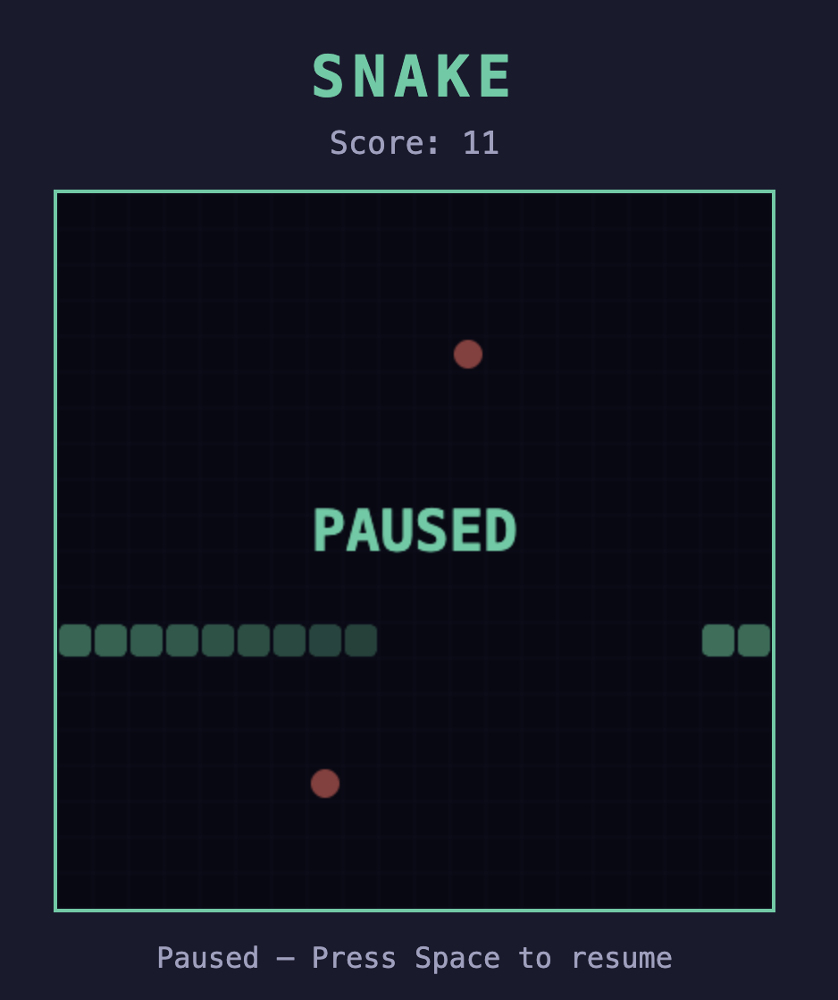

# Snake Game

A classic Snake game that runs in the browser, served by a minimal Python HTTP server.



## Requirements

- Python 3.6+

## How to start the server

```bash
python3 server.py
```

The server starts on **http://localhost:8000** and opens the game in your default browser automatically.

Press **Ctrl+C** in the terminal to stop the server.

## How to play

| Key | Action |
|-----|--------|
| Arrow keys | Move the snake |
| Any arrow key | Start / restart the game |
| Space | Pause / resume |

### Food

| Food | Appearance | Effect |
|------|-----------|--------|
| Regular food | Red circle | +1 tail segment, +1 point |
| Super food | Gold star | +2 tail segments, +3 points |

- Super food appears every ~3 seconds and disappears after ~6 seconds (it blinks when expiring).
- The snake wraps around — exiting one edge brings it out the opposite side.
- Hitting your own body ends the game.

## Files

```
snake_game/
├── index.html   # Game (HTML + CSS + JS, no dependencies)
├── server.py    # Python HTTP server
└── README.md    # This file
```
